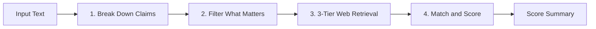

# Sherlock

[](https://opensource.org/licenses/MIT)
[](https://arxiv.org/abs/2403.18802)
[](https://agentskills.io)
[](evals/)

> A practical fact-checker and researcher powered by Google DeepMind's SAFE (Search-Augmented Factuality Evaluator) framework. Built to check if claims are actually backed up by real, verifiable sources without making things up.

---

## Overview

Sherlock helps agents and users fact-check text, verify claims, and research information reliably. It works across Google Antigravity, Gemini CLI, Claude Code, Cursor, and Codex.

Instead of guessing or trying to check a huge wall of text all at once, Sherlock breaks text down into small, standalone facts, searches for real evidence using a 3-tier retrieval protocol, and checks whether the sources actually support what was said.

### Persona
Straightforward, casual, and friendly. Explains things in plain everyday English. No robotic fluff, no dramatic theater, and no pretentious jargon. Just clean logic, real evidence, and honest answers.

Every response starts with a clear header indicator so you always know Sherlock is handling the answer:
`Mode: <sherlock-validate | sherlock-search | sherlock-help> | Focus: <topic or goal>`

---

## The SAFE Method: How It Works

Sherlock follows the 4-step SAFE pipeline from Google DeepMind:



1. **Break Down Claims**: Splits complex sentences into standalone statements. Clarifies pronouns ("he", "they", "it") with the actual names so each statement stands completely on its own.
2. **Filter What Matters**: Focuses strictly on facts that matter to the topic, leaving out greetings and subjective opinions.
3. **Search for Evidence (The 3-Tier Retrieval Protocol)**:
   - **Tier 1 (Clean Text First)**: Uses search snippets and fast text readers. Eliminates transcription errors and token waste.
   - **Tier 2 (Live Browser DOM)**: If a page requires JavaScript or renders blank, loads it in a headless browser and extracts live text from the DOM or Accessibility Tree.
   - **Tier 3 (Targeted Screenshot + OCR)**: Reserved strictly for non-text graphics (interactive charts, canvas graphs, scanned PDFs). Crops directly to the element rather than screenshotting the whole screen.
4. **Match and Score**: Evaluates whether the sources prove the claim:
   - **Supported**: Direct match confirmed by the source.
   - **Contradicted**: Proven wrong or different by the source.
   - **Unsupported Leap**: Sounds plausible, but the source does not actually prove it.
   - **Unverifiable**: No reliable public evidence found.

---

## The Three Modes

Sherlock automatically picks the right mode based on what you ask:

### 1. `sherlock-validate` (Checking Existing Text)
*Use when you want to check an article, draft, or list of claims.*

- Breaks down the text into numbered statements (`[AF-1]`, `[AF-2]`).
- Checks in with you before running web searches to make sure the statements look right.
- Gives you direct quotes, links (with text fragment highlights), and clear explanations for each statement.
- Calculates your overall SAFE score:
  $$\text{SAFE Score} = \frac{\text{Supported Statements}}{\text{Total Relevant Statements}} \times 100\%$$
- Asks if you want help rewriting or fixing any contradicted claims.

### 2. `sherlock-search` (Researching from Scratch)
*Use when you need to research a topic or gather verified facts.*

- Gathers facts using the 3-tier retrieval protocol from reliable, trustworthy sources.
- Gives only clear facts backed up by real quotes and URLs.
- Never guesses or connects dots without clear proof.

### 3. `sherlock-help` (Planning and Advice)
*Use when you want advice on how to fact-check something.*

- Helps you break down a complex topic.
- Gives you a practical search plan and tips on which sources to trust.

---

## Orchestration & Sub-Skills Architecture

Sherlock serves as the **Master Orchestrator**. It evaluates incoming tasks, extracts atomic propositions, and rotates work across specialized sub-skills categorized by use case inside the [`skills/`](skills/) folder:

```
sherlock/
├── SKILL.md                          # Master Orchestrator prompt & routing index
├── README.md                         # Architecture overview and documentation
├── sherlock-ui.bat                   # 1-Click Perplexity-style local web studio launcher
├── sherlock_ui.py                    # Local Investigation Studio backend (FastAPI + CDP WebSocket)
├── sherlock-scrape.bat               # Interactive 1-click Windows desktop visual scraper
├── sherlock_scrape.py                # 2-Phase Scout & Headed DOM validator CLI
├── LICENSE                           # MIT License
├── references/                       # Conceptual guides & protocols
│   ├── safe_framework.md             # SAFE factuality evaluation methodology
│   └── retrieval_strategy.md         # 3-tier evidence retrieval hierarchy
├── evals/                            # Evaluation benchmark suite
│   ├── eval_cases.json
│   └── run_eval.py
├── scripts/                          # Sherlock core utilities
│   ├── safe_score.py                 # Factual precision calculator (Markdown/JSON, --ci)
│   ├── browser_fetch.py              # Playwright DOM text & element screenshot tool (--scout)
│   ├── deslop_filter.py              # Deterministic anti-slop linter & fluff sanitizer
│   └── fact_cache.py                 # Local verified fact knowledge cache with TTL
└── skills/                           # Curated sub-skills ecosystem
    ├── factuality_verification/      # Category 1: Atomic fact checkers
    │   ├── safe/                     # Google DeepMind SAFE protocol
    │   └── factscore/                # FActScore atomic proposition evaluator
    ├── research_synthesis/           # Category 2: Autonomous research engines
    │   ├── storm/                    # Stanford STORM multi-perspective RAG
    │   └── deep-research/            # Recursive multi-turn research protocol
    ├── scraping_automation/          # Category 3: Ground-truth web extractors
    │   └── sherlock-scrape/          # Visual headed Playwright DOM sniper
    └── anti_slop/                    # Category 4: Anti-bloat & prose sanitizers
        ├── anti-slop/                # Banned AI tics & verbal fluff filter
        └── ponytail/                 # Senior dev YAGNI & standard library ladder
```

---

## Sub-Skill Categories

| Category | Skills | Role in Orchestration |
| :--- | :--- | :--- |
| **1. Factuality & Verification** | `safe`, `factscore` | Breaks sentences into atomic claims and verifies against factual knowledge bases. |
| **2. Research & Synthesis** | `storm`, `deep-research` | Drives multi-angle research, expert persona inquiries, and cited report outlines. |
| **3. Scraping Automation** | `sherlock-scrape` | Live visual browser execution with Playwright; outputs yellow-highlighted Chrome proof links. |
| **4. Anti-Slop & De-bloat** | `anti-slop`, `ponytail` | Eliminates filler phrases, delivers answers first, and enforces minimal, standard-library code. |

---

## Core Utilities & Upgrades

Sherlock provides 4 built-in Python tools designed for agent pipelines and deterministic fact-checking:

### 1. Anti-Slop Filter (`scripts/deslop_filter.py`)
Deterministic regex sanitizer removing conversational AI tics, filler words, and throat-clearing preambles:
```bash
python scripts/deslop_filter.py input.txt --output clean.txt
python scripts/deslop_filter.py input.txt --check-only --json
```

### 2. Verified Fact Knowledge Cache (`scripts/fact_cache.py`)
Key-value storage with configurable TTL (default 24h) to avoid re-searching verified propositions:
```bash
python scripts/fact_cache.py set "iphone-15-pro-price" '{"price": 31500, "source": "Greenhills"}' --ttl 86400
python scripts/fact_cache.py get "iphone-15-pro-price"
python scripts/fact_cache.py list
```

### 3. Precision Calculator & CI Mode (`scripts/safe_score.py`)
Computes SAFE precision scores with claim-level breakdowns, JSON output, and CI failure thresholds:
```bash
python scripts/safe_score.py input_claims.txt --json
python scripts/safe_score.py input_claims.txt --ci 80.0
```

### 4. Headed Visual Scraper & Reusable Playwright Engine (`scripts/browser_fetch.py`)
Headed Playwright engine that pops open a visible browser on screen for live searching and DOM extraction:
```bash
# Live on-screen search and scrape (Headed by default)
python scripts/browser_fetch.py --scout "iphone 15 pro greenhills price"

# Scrape specific URLs with proof screenshot & JSON export
python scripts/browser_fetch.py https://example.com --selector "#price-tag" --screenshot-out proof.png --json-out out.json

# Reusable Python API
from browser_fetch import SherlockBrowser
async with SherlockBrowser(headed=True) as engine:
    leads = await engine.visual_search("apple iphone specs")
    results = await engine.scrape_batch(leads)
```

### 5. 1-Click Desktop Scraper (`sherlock-scrape.bat` / `sherlock_scrape.py`)
Run directly in your Windows terminal or double-click to watch the headed browser open on your desktop:
```bash
# Run with a natural language query:
.\sherlock-scrape.bat "always yours never mine ticket in cinemas price"

# Or run with no arguments for an interactive input prompt:
.\sherlock-scrape.bat
```
*Logic: Phase 1 conducts search reconnaissance to discover primary sources -> Phase 2 opens headed Chromium on your desktop to validate the live DOM.*

### 6. Perplexity-Style Local Web Studio (`sherlock-ui.bat` / `sherlock_ui.py`)
A standalone local web studio that streams live Playwright Chromium CDP screencasts directly to your browser:
```bash
# Launch the local web studio (opens http://localhost:7860):
.\sherlock-ui.bat
# Or run with python:
python sherlock_ui.py
```
*Features: Zero emojis (clean monochrome SVG icons), strict anti-slop typography, dual-pane live browser screencast, real-time source pill chips, and SAFE factuality scoring.*

---

## Testing & Evaluations

You can run the evaluation test suite at any time:

```bash
python evals/run_eval.py
```

Output:
```text
Running Sherlock SAFE Evaluation Suite (4 cases)...

  [PASS] eval_001_single_supported: SAFE Score 100.0% matches expected 100.0%
  [PASS] eval_002_explicit_contradiction: SAFE Score 50.0% matches expected 50.0%
  [PASS] eval_003_compound_mixed_claims: SAFE Score 50.0% matches expected 50.0%
  [PASS] eval_004_unsupported_leap: SAFE Score 33.33% matches expected 33.33%

Evaluation Summary: 4 passed, 0 failed.
All evaluation benchmarks passed successfully.
```

---

## Setup & Installation

### Global Installation (Antigravity / Gemini CLI)
```bash
# Windows PowerShell
New-Item -ItemType Directory -Force -Path "$HOME\.gemini\config\skills\sherlock"
Copy-Item -Path "SKILL.md", "references", "scripts", "evals", "examples", "README.md" -Destination "$HOME\.gemini\config\skills\sherlock" -Recurse -Force

# Linux / macOS
mkdir -p ~/.gemini/config/skills/sherlock
cp -r SKILL.md references scripts evals examples README.md ~/.gemini/config/skills/sherlock/
```

### Project Installation (Claude Code / Agents)
```bash
mkdir -p .agents/skills/sherlock
cp -r SKILL.md references scripts .agents/skills/sherlock/
```

---

## License

Distributed under the [MIT License](LICENSE).
