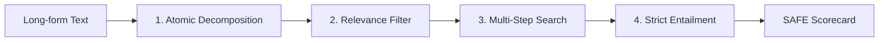

# Sherlock 🔎

[](https://opensource.org/licenses/MIT)
[](https://arxiv.org/abs/2403.18802)
[](https://agentskills.io)
[](evals/)

> **Master fact-checker and strict evidence router powered by Google DeepMind's SAFE (Search-Augmented Factuality Evaluator) framework and compliant with the Anthropic Agent Skills Open Standard. Intolerant of hallucinations, speculation, or unsupported leaps.**

---

## Overview

**Sherlock** is an agentic fact-checking and strict research skill designed for modern AI pair-programming and autonomous workflows (Google Antigravity, Gemini CLI, Claude Code, Cursor, and Codex).

Built around Google DeepMind's seminal research (*"Long-form Factuality in Large Language Models"*, Wei et al., 2024) and optimized according to Anthropic's **Agent Skills** specification, Sherlock breaks composite claims into atomic, de-contextualized propositions, searches authoritative sources, and evaluates claims through strict mathematical entailment.

### Persona
Brilliant, impatient fact-checker. Strictly pure logic, atomic fact decomposition, and explicit retrieval-grounded proof. Zero tolerance for hallucinations, conversational filler, or ungrounded assertions.

---

## ⚡ The SAFE Framework

Sherlock operates strictly along the 4-stage **SAFE** evaluation pipeline:



1. **Decomposition & De-contextualization**: Breaks compound statements into standalone atomic facts. Resolves ambiguous pronouns ("he", "it", "they") and relative timestamps into canonical entities and dates.
2. **Relevance Filtering**: Classifies whether each atomic assertion is essential to directly answering the inquiry.
3. **Multi-Step Search & Verification**: Dispatches targeted, high-precision web queries against each individual atomic statement.
4. **Strict Entailment Evaluation**: Categorizes each claim into one of four rigid truth buckets:
   - ✅ **Supported**: Confirmed directly by verbatim text in an authoritative source.
   - ❌ **Contradicted**: Explicitly refuted by verified evidence.
   - ⚠️ **Unsupported Leap**: Plausible or partially related, but lacks explicit, incontrovertible proof.
   - ❓ **Unverifiable**: No authoritative search evidence exists to confirm or deny.

---

## 🧭 Smart Routing Logic

Sherlock automatically routes user queries into three specialized execution modes:

### 1. `sherlock-validate` (Post-Checker)
*Triggered when evaluating existing texts, articles, memos, or claims.*

- **Decomposes** text into numbered atomic claims (`[AF-1]`, `[AF-2]`).
- **HITL Pause**: Requests user confirmation before issuing external search queries.
- **Retrieval & Valuation**: Delivers verbatim quotes, canonical URLs, and direct entailment rationale.
- **SAFE Factuality Score**:
  $$\text{SAFE Factuality Score} = \frac{\text{Supported Facts}}{\text{Total Relevant Facts}} \times 100\%$$
- **Deep-Dive HITL**: Offers follow-up forensic investigation on contradicted or unsupported claims.

### 2. `sherlock-search` (Strict Researcher)
*Triggered when gathering facts, discovering information, or researching from scratch.*

- Operates under a strict zero-hallucination mandate.
- Returns **ONLY** atomic, verifiable facts accompanied by verbatim quotes and source URLs.
- Outright refuses to infer, extrapolate, speculate, or connect dots without explicit proof.

### 3. `sherlock-help` (Advisor)
*Triggered when seeking research methodology, verification planning, or query architecture.*

- Assesses research objectives, identifying potential hallucination hotspots.
- Delivers a structured, step-by-step verification blueprint and source triangulation hierarchy.

---

## 📁 Repository Structure

Adheres strictly to the Anthropic Agent Skills directory standard with Progressive Disclosure and Evaluation-Driven Development:

```text
sherlock/
├── SKILL.md                          # Primary agent skill specification & routing
├── README.md                         # Documentation & installation guide
├── LICENSE                           # MIT License
├── references/
│   └── safe_framework.md             # Theoretical & mathematical reference guide
├── examples/
    └── sample_verification.md        # Complete walkthroughs for validate, search & help
├── evals/
│   ├── eval_cases.json               # Benchmark verification test suite
│   └── run_eval.py                   # Automated test harness for SAFE math and contracts
└── scripts/
    └── safe_score.py                 # Standalone SAFE metric calculator CLI
```

---

## 🧪 Evaluation Suite

Per Anthropic's skill authoring guidelines, Sherlock includes an evaluation harness to guarantee factual precision metrics:

```bash
python evals/run_eval.py
```

Output:
```text
Running Sherlock SAFE Evaluation Suite (4 cases)...

  [PASS] eval_001_single_supported: SAFE Score 100.0% matches expected 100.0%
  [PASS] eval_002_explicit_contradiction: SAFE Score 50.0% matches expected 50.0%
  [PASS] eval_003_compound_mixed_claims: SAFE Score 50.0% matches expected 50.0%
  [PASS] eval_004_unsupported_leap: SAFE Score 33.33% matches expected 33.33%

Evaluation Summary: 4 passed, 0 failed.
All evaluation benchmarks passed successfully.
```

---

## 🚀 Installation & Setup

### 1. Global Installation (Antigravity / Gemini CLI)
Install Sherlock into your global skills directory so it is instantly available across all your projects:

```bash
# Windows PowerShell
New-Item -ItemType Directory -Force -Path "$HOME\.gemini\config\skills\sherlock"
Copy-Item -Path "SKILL.md", "references", "scripts", "evals", "examples" -Destination "$HOME\.gemini\config\skills\sherlock" -Recurse -Force

# Linux / macOS
mkdir -p ~/.gemini/config/skills/sherlock
cp -r SKILL.md references scripts evals examples ~/.gemini/config/skills/sherlock/
```

### 2. Project-Level Installation (Claude Code / Agents)
To share Sherlock with your team in a specific repository:

```bash
mkdir -p .agents/skills/sherlock
cp -r SKILL.md references scripts .agents/skills/sherlock/
```

---

## 📚 References & Citation

- **SAFE Paper**: Jerry Wei, Chengrun Yang, Xinying Song, Yifeng Lu, Nathan Hu, Jie Huang, Dustin Tran, Denny Zhou, Quoc V. Le (Google DeepMind, 2024). *"Long-form Factuality in Large Language Models"*. [arXiv:2403.18802](https://arxiv.org/abs/2403.18802).
- **Agent Skills Standard**: [agentskills.io](https://agentskills.io) & [Anthropic Agent Skills Documentation](https://platform.claude.com/docs/agents-and-tools/agent-skills/).

---

## 📄 License

Distributed under the [MIT License](LICENSE).
