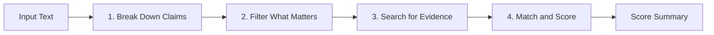

# Sherlock

[](https://opensource.org/licenses/MIT)
[](https://arxiv.org/abs/2403.18802)
[](https://agentskills.io)
[](evals/)

> A practical fact-checker and researcher powered by Google DeepMind's SAFE (Search-Augmented Factuality Evaluator) framework. Built to check if claims are actually backed up by real, verifiable sources without making things up.

---

## Overview

Sherlock helps agents and users fact-check text, verify claims, and research information reliably. It works across Google Antigravity, Gemini CLI, Claude Code, Cursor, and Codex.

Instead of guessing or trying to check a huge wall of text all at once, Sherlock breaks text down into small, standalone facts, searches for real evidence, and checks whether the sources actually support what was said.

### Persona
Straightforward, casual, and friendly. Explains things in plain everyday English. No robotic fluff, no dramatic theater, and no pretentious jargon. Just clean logic, real evidence, and honest answers.

---

## The SAFE Method: How It Works

Sherlock follows the 4-step SAFE pipeline from Google DeepMind:



1. **Break Down Claims**: Splits complex sentences into standalone statements. Clarifies pronouns ("he", "they", "it") with the actual names so each statement stands completely on its own.
2. **Filter What Matters**: Focuses strictly on facts that matter to the topic, leaving out greetings and subjective opinions.
3. **Search for Evidence**: Looks up reliable sources for each statement using targeted searches.
4. **Match and Score**: Evaluates whether the sources prove the claim:
   - **Supported**: Direct match confirmed by the source.
   - **Contradicted**: Proven wrong or different by the source.
   - **Unsupported Leap**: Sounds plausible, but the source does not actually prove it.
   - **Unverifiable**: No reliable public evidence found.

---

## The Three Modes

Sherlock automatically picks the right mode based on what you ask:

### 1. `sherlock-validate` (Checking Existing Text)
*Use when you want to check an article, draft, or list of claims.*

- Breaks down the text into numbered statements (`[AF-1]`, `[AF-2]`).
- Checks in with you before running web searches to make sure the statements look right.
- Gives you direct quotes, links, and clear explanations for each statement.
- Calculates your overall SAFE score:
  $$\text{SAFE Score} = \frac{\text{Supported Statements}}{\text{Total Relevant Statements}} \times 100\%$$
- Asks if you want help rewriting or fixing any contradicted claims.

### 2. `sherlock-search` (Researching from Scratch)
*Use when you need to research a topic or gather verified facts.*

- Gathers facts only from reliable, trustworthy sources.
- Gives only clear facts backed up by real quotes and URLs.
- Never guesses or connects dots without clear proof.

### 3. `sherlock-help` (Planning and Advice)
*Use when you want advice on how to fact-check something.*

- Helps you break down a complex topic.
- Gives you a practical search plan and tips on which sources to trust.

---

## Repository Structure

```text
sherlock/
├── SKILL.md                          # Main skill instructions
├── README.md                         # Documentation and setup
├── LICENSE                           # MIT License
├── references/
│   └── safe_framework.md             # Background guide on the SAFE method
├── examples/
│   └── sample_verification.md        # Example walkthroughs
├── evals/
│   ├── eval_cases.json               # Benchmark test cases
│   └── run_eval.py                   # Evaluation test runner
└── scripts/
    └── safe_score.py                 # Standalone score calculator
```

---

## Testing & Evaluations

You can run the evaluation test suite at any time:

```bash
python evals/run_eval.py
```

Output:
```text
Running Sherlock SAFE Evaluation Suite (4 cases)...

  [PASS] eval_001_single_supported: SAFE Score 100.0% matches expected 100.0%
  [PASS] eval_002_explicit_contradiction: SAFE Score 50.0% matches expected 50.0%
  [PASS] eval_003_compound_mixed_claims: SAFE Score 50.0% matches expected 50.0%
  [PASS] eval_004_unsupported_leap: SAFE Score 33.33% matches expected 33.33%

Evaluation Summary: 4 passed, 0 failed.
All evaluation benchmarks passed successfully.
```

---

## Setup & Installation

### Global Installation (Antigravity / Gemini CLI)
```bash
# Windows PowerShell
New-Item -ItemType Directory -Force -Path "$HOME\.gemini\config\skills\sherlock"
Copy-Item -Path "SKILL.md", "references", "scripts", "evals", "examples", "README.md" -Destination "$HOME\.gemini\config\skills\sherlock" -Recurse -Force

# Linux / macOS
mkdir -p ~/.gemini/config/skills/sherlock
cp -r SKILL.md references scripts evals examples README.md ~/.gemini/config/skills/sherlock/
```

### Project Installation (Claude Code / Agents)
```bash
mkdir -p .agents/skills/sherlock
cp -r SKILL.md references scripts .agents/skills/sherlock/
```

---

## License

Distributed under the [MIT License](LICENSE).
