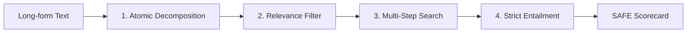

# Sherlock 🔎

[](https://opensource.org/licenses/MIT)
[](https://arxiv.org/abs/2403.18802)
[](https://antigravity.google)

> **Master fact-checker and strict evidence router powered by Google DeepMind's SAFE (Search-Augmented Factuality Evaluator) framework. Intolerant of hallucinations, speculation, or unsupported leaps.**

---

## Overview

**Sherlock** is an agentic fact-checking skill designed for modern AI pair-programming and research environments (Google Antigravity, Gemini CLI, Claude Code, Cursor, and Codex). 

Rooted in Google DeepMind's groundbreaking research (*"Long-form Factuality in Large Language Models"*, Wei et al., 2024), Sherlock dismantles complex texts into atomic, de-contextualized propositions, searches across authoritative sources, and evaluates each claim through strict mathematical entailment.

### Persona
Brilliant, impatient fact-checker. Strictly pure logic, atomic fact decomposition, and explicit retrieval-grounded proof. Zero tolerance for hallucinations, conversational filler, or ungrounded assertions.

---

## ⚡ The SAFE Framework

Sherlock operates strictly along the 4-stage **SAFE** evaluation pipeline:



1. **Decomposition & De-contextualization**: Breaks compound statements into standalone atomic facts. Resolves ambiguous pronouns ("he", "it", "they") and relative timestamps into standalone entities and dates.
2. **Relevance Filtering**: Classifies whether each atomic assertion is essential to directly addressing the user inquiry.
3. **Multi-Step Search & Verification**: Dispatches targeted, high-precision web queries against each individual atomic statement.
4. **Strict Entailment Evaluation**: Categorizes each claim into one of four rigid truth buckets:
   - ✅ **Supported**: Confirmed directly by verbatim text in an authoritative source.
   - ❌ **Contradicted**: Explicitly refuted by verified evidence.
   - ⚠️ **Unsupported Leap**: Plausible or partially related, but lacks explicit, incontrovertible proof.
   - ❓ **Unverifiable**: No authoritative search evidence exists to confirm or deny.

---

## 🧭 Smart Routing Logic

Sherlock automatically routes user queries into three specialized execution modes:

### 1. `sherlock-validate` (Post-Checker)
*Triggered when evaluating existing texts, articles, memos, or claims.*

- **Decomposes** text into numbered atomic claims (`[AF-1]`, `[AF-2]`).
- **HITL Pause**: Requests user confirmation before issuing external search queries.
- **Retrieval & Valuation**: Delivers verbatim quotes, canonical URLs, and direct entailment rationale.
- **SAFE Factuality Score**:
  $$\text{SAFE Factuality Score} = \frac{\text{Supported Facts}}{\text{Total Relevant Facts}} \times 100\%$$
- **Deep-Dive HITL**: Offers follow-up forensic investigation on contradicted or unsupported claims.

### 2. `sherlock-search` (Strict Researcher)
*Triggered when gathering facts, discovering information, or researching from scratch.*

- Operates under a strict zero-hallucination mandate.
- Returns **ONLY** atomic, verifiable facts accompanied by verbatim quotes and source URLs.
- Outright refuses to infer, extrapolate, speculate, or connect dots without explicit proof.

### 3. `sherlock-help` (Advisor)
*Triggered when seeking research methodology, verification planning, or query architecture.*

- Assesses research objectives, identifying potential hallucination hotspots.
- Delivers a structured, step-by-step verification blueprint and source triangulation hierarchy.

---

## 📁 Repository Structure

```text
sherlock/
├── SKILL.md                          # Primary agent skill specification
├── README.md                         # Documentation & installation guide
├── LICENSE                           # MIT License
├── references/
│   └── safe_framework.md             # DeepMind SAFE theoretical & mathematical reference
└── examples/
    └── sample_verification.md        # Complete walkthroughs for validate, search & help
```

---

## 🚀 Installation & Setup

### 1. Global Installation (Antigravity / Gemini CLI)
Install Sherlock into your global skills directory so it is instantly available across all your projects:

```bash
# Windows PowerShell
New-Item -ItemType Directory -Force -Path "$HOME\.gemini\config\skills\sherlock"
Copy-Item -Path "SKILL.md", "references" -Destination "$HOME\.gemini\config\skills\sherlock" -Recurse

# Linux / macOS
mkdir -p ~/.gemini/config/skills/sherlock
cp -r SKILL.md references ~/.gemini/config/skills/sherlock/
```

### 2. Project-Level Installation
To share Sherlock with your team in a specific repository:

```bash
mkdir -p .agents/skills/sherlock
cp SKILL.md .agents/skills/sherlock/
```

---

## 🔬 Example Output (`sherlock-validate`)

```markdown
### 🔎 Sherlock Verification Dossier

**Target Claim**: "In 2012, DeepMind was acquired by Google for $500 million."

#### Atomic Claims & Verification
- **[AF-1] DeepMind was acquired by Google.**
  - **Status**: ✅ **Supported**
  - **Quote**: "Google has acquired London-based artificial intelligence company DeepMind..."
  - **Source**: [BBC News](https://www.bbc.com/news/technology-25907470)
  - **Analysis**: Direct verbatim entailment.

- **[AF-2] The acquisition took place in 2012.**
  - **Status**: ❌ **Contradicted**
  - **Quote**: "Google acquired DeepMind in January 2014 for an estimated £400m..."
  - **Source**: [The Guardian](https://www.theguardian.com/technology/2014/jan/27/google-acquires-artificial-intelligence-startup-deepmind)
  - **Analysis**: Acquisition occurred in 2014, contradicting the 2012 date.

- **[AF-3] The acquisition price was $500 million.**
  - **Status**: ✅ **Supported**
  - **Quote**: "...agreed to acquire DeepMind Technologies for more than $500 million."
  - **Source**: [Reuters](https://www.reuters.com/article/technology/google-to-buy-artificial-intelligence-firm-deepmind-idUSDEEAA0039/)
  - **Analysis**: Directly supported by reporting.

#### 📊 SAFE Factuality Scoreboard
| Status | Count | Percentage |
| :--- | :--- | :--- |
| **Supported** | 2 | 66.7% |
| **Contradicted** | 1 | 33.3% |
| **Unsupported Leap** | 0 | 0.0% |
| **Unverifiable** | 0 | 0.0% |
| **Total Evaluated** | 3 | 100% |

**Overall SAFE Factuality Score**: **66.7%**
```

---

## 📚 References & Citation

- **SAFE Paper**: Jerry Wei, Chengrun Yang, Xinying Song, Yifeng Lu, Nathan Hu, Jie Huang, Dustin Tran, Denny Zhou, Quoc V. Le (Google DeepMind, 2024). *"Long-form Factuality in Large Language Models"*. [arXiv:2403.18802](https://arxiv.org/abs/2403.18802).

---

## 📄 License

Distributed under the [MIT License](LICENSE).
