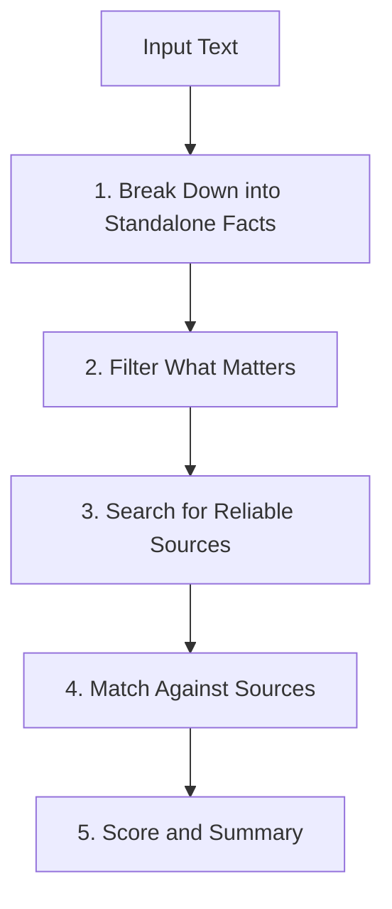

# Google DeepMind SAFE Framework Reference Guide

This reference document outlines the core concepts of the **Search-Augmented Factuality Evaluator (SAFE)** framework, developed by Google DeepMind (Wei et al., 2024; *"Long-form Factuality in Large Language Models"*).

---

## 1. Why Check Atomic Facts Instead of Whole Paragraphs?

Checking an entire paragraph all at once often fails for simple reasons:
1. **Mixed Accuracy**: A single sentence might contain two accurate points and one mistaken date. Evaluating the whole sentence at once either misses the mistake or throws out the good facts.
2. **Pronoun Confusion**: Words like "they", "this company", or "later" get confusing when evaluated out of context.
3. **Assumptions**: People or models often assume things that the source didn't actually say.

SAFE solves this by breaking statements down into small, standalone facts and checking each one against real search results.

---

## 2. The Four-Stage SAFE Process

### Stage 1: Breaking Down Statements
Split compound sentences into the smallest factual statements that can be verified on their own.

#### Clarifying Pronouns and Dates
- **Pronouns**: Replace words like "He", "She", or "They" with the actual name or company.
- **Dates**: Change relative phrases like "last year" or "recently" into the actual year or date when known.
- **Joined Clauses**: Split sentences joined by "and" or "while" into distinct points.

*Example*:
> "In 2012, DeepMind was acquired by Google for over $500 million and expanded its London office."

Splits into:
1. `[AF-1]` DeepMind was acquired by Google.
2. `[AF-2]` DeepMind was acquired in the year 2012. *(Fact-check catches this: the deal was announced in January 2014)*
3. `[AF-3]` The acquisition price was over $500 million.
4. `[AF-4]` DeepMind expanded its office in London.

### Stage 2: Filtering What Matters
Only keep statements that actually answer the prompt. Skip pleasantries, conversational filler, and general opinions.

### Stage 3: Targeted Search
Formulate simple, specific search queries for each individual point. Focus on proper names, key figures, and dates.

### Stage 4: Matching Results
Classify how well the search evidence backs up each claim:

| Status | What it means | How to decide |
| :--- | :--- | :--- |
| **Supported** | The source proves it. | The source directly confirms the statement. |
| **Contradicted** | The source proves it wrong. | The source gives conflicting facts (different date, different number, or denied). |
| **Unsupported Leap** | Not enough proof. | Plausible or related, but the source does not actually state it directly. |
| **Unverifiable** | No reliable source. | No reliable public source found to confirm or deny. |

---

## 3. How the Score is Calculated

Given:
- $N_{\text{rel}}$: Total relevant statements
- $S$: Number of statements that are **Supported**

### SAFE Score
$$\text{SAFE Score} = \frac{S}{N_{\text{rel}}} \times 100\%$$

---

## 4. Source Hierarchy

When comparing sources, prioritize:
1. **Primary records**: Official filings, government releases, and court records.
2. **Official announcements**: Company press releases and verified documentation.
3. **Major reporting**: Reliable news outlets with editorial standards.
4. **General blogs & social posts**: Useful for hints, but need verification from stronger sources.
