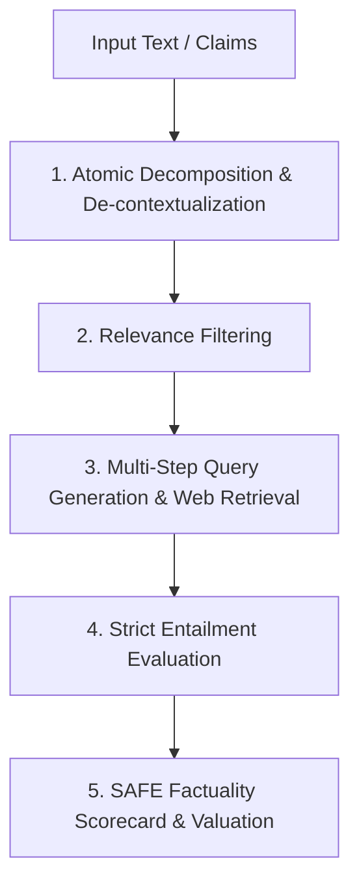

# Google DeepMind SAFE Framework Reference Guide

This reference document outlines the theoretical foundation and operational implementation of the **Search-Augmented Factuality Evaluator (SAFE)** framework, introduced by Google DeepMind (Wei et al., 2024; *"Long-form Factuality in Large Language Models"*).

---

## 1. Motivation: The Failure of Monolithic Fact-Checking

Traditional LLM fact-checking attempts to evaluate an entire paragraph or response at once. This fails because:
1. **Compounded Truth Value**: A single sentence may contain three true assertions and one subtle hallucination. Monolithic evaluation either overlooks the error or discounts the entire statement.
2. **Contextual Conflation**: Anaphoric references ("they", "this company", "subsequently") carry baggage across sentence boundaries, confusing search APIs and retrieval modules.
3. **Speculative Interpolation**: Search evaluators often assume unstated premises instead of demanding explicit, verbatim textual entailment.

SAFE resolves these vulnerabilities through **Atomic Decomposition** and **Strict Entailment Retrieval**.

---

## 2. Four-Stage SAFE Pipeline

### Stage 1: Atomic Fact Decomposition & De-contextualization
A long-form response is segmented into atomic facts. An atomic fact is the smallest self-contained assertion that can be independently validated as true or false.

#### De-contextualization Rules
- **Pronoun Resolution**: Replace "He", "She", "It", "They" with the canonical full name or entity title.
- **Temporal Anchoring**: Resolve relative timestamps ("last year", "recently", "five years later") into explicit years, dates, or intervals whenever derivable.
- **Subject-Predicate Disentanglement**: Split compound clauses joined by conjunctions ("and", "as well as", "where") into distinct atomic facts.

*Example*:
> "In 2012, DeepMind was acquired by Google for over $500 million and expanded its London lab."

Decomposes into:
1. `[AF-1]` DeepMind was acquired by Google.
2. `[AF-2]` DeepMind was acquired in the year 2012. *(Fact-check will catch the year discrepancy: acquisition announced Jan 2014)*
3. `[AF-3]` The acquisition price of DeepMind was over $500 million.
4. `[AF-4]` DeepMind expanded its research lab located in London.

### Stage 2: Relevance Filtering
Each atomic statement is assessed against the user's objective:
- **Relevant**: Statement directly informs the answer or claim under test.
- **Irrelevant**: Conversational greetings, disclaimers, stylistic transitions, or meta-commentary ("As is widely known..."). Only relevant atomic facts enter the verification denominator.

### Stage 3: Multi-Step Search & Query Synthesis
For each atomic fact, formulate 1 to 3 targeted search queries:
- Prioritize specific entities, proper nouns, and definitive verbs.
- Use exact string quotes `\"...\"` for unique identifiers or direct quotes.
- If initial queries yield conflicting or thin results, perform query reformulations.

### Stage 4: Strict Entailment Classification
Retrieved search snippets are matched against the atomic statement under strict natural language entailment:

| Status | Definition | Operational Standard |
| :--- | :--- | :--- |
| **Supported** | Premise entails hypothesis. | Source text directly, unambiguously confirms the atomic claim. |
| **Contradicted** | Premise refutes hypothesis. | Source text presents conflicting facts (e.g. different date, different person, negative outcome). |
| **Unsupported Leap** | Premise does not entail hypothesis. | Fact is plausible or adjacent, but lacks explicit, incontrovertible proof in the source. |
| **Unverifiable** | Absence of credible evidence. | No authoritative search results exist to confirm or refute the claim. |

---

## 3. Mathematical Metrics

Given:
- $N$: Total atomic claims extracted
- $N_{\text{rel}}$: Total relevant atomic claims
- $S$: Number of claims classified as **Supported**
- $C$: Number of claims classified as **Contradicted**
- $U_{\text{leap}}$: Number of claims classified as **Unsupported Leap**
- $U_{\text{unv}}$: Number of claims classified as **Unverifiable**

### SAFE Factuality Score (Precision)
$$\text{SAFE Factuality Score} = \frac{S}{N_{\text{rel}}} \times 100\%$$

### Error Distribution
$$\text{Contradiction Rate} = \frac{C}{N_{\text{rel}}} \times 100\%$$
$$\text{Leap/Hallucination Rate} = \frac{U_{\text{leap}} + U_{\text{unv}}}{N_{\text{rel}}} \times 100\%$$

---

## 4. Source Hierarchy & Triangulation

When resolving competing claims, Sherlock strictly ranks source authority:
1. **Tier 1 (Primary / Regulatory)**: SEC filings (10-K, 8-K), government official gazettes, court filings, patent registries, academic papers (peer-reviewed).
2. **Tier 2 (Official Corporate / Institution)**: Press releases, official company documentation, verified corporate blogs.
3. **Tier 3 (Authoritative News & Reporting)**: Reuters, Bloomberg, AP, Financial Times, Wall Street Journal.
4. **Tier 4 (Secondary & Community)**: Generic blogs, forums, aggregators (insufficient alone for *Supported* classification without cross-verification).
